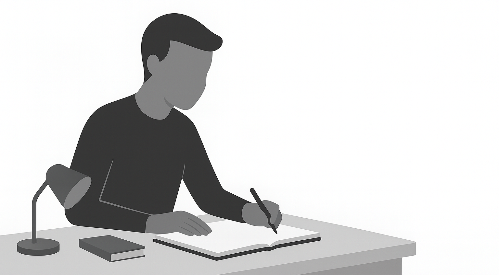
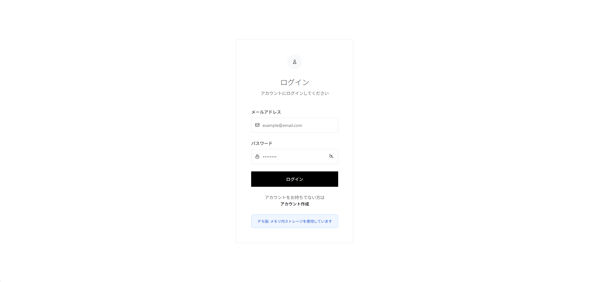
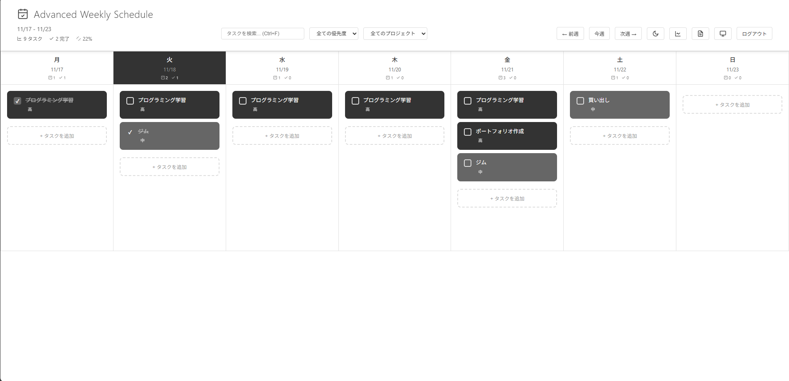
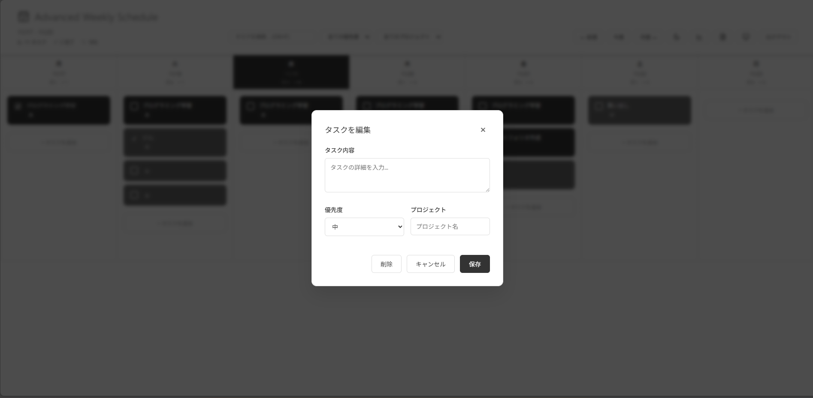
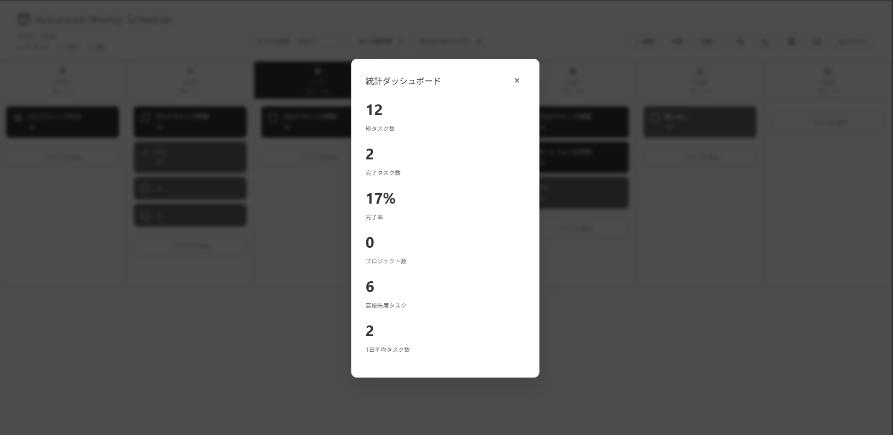
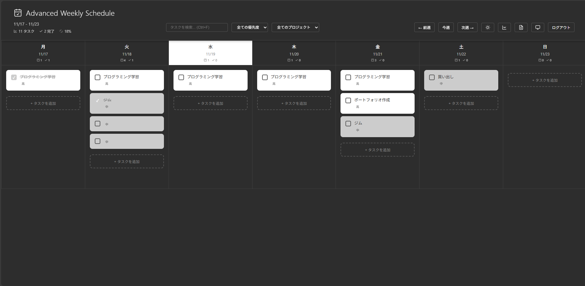

# To-Do App

これは、HTML、CSS、JavaScriptで作成された、シンプルで直感的なTo-Doリストアプリケーションです。

## 主な機能 (工夫した点)

<table>
  <tr>
    <td width="50%">
      <h3>トップ画面</h3>
      
      
ユーザーの親しみを得るためのデザインを考えました。

    </td>
    <td width="50%">
      <h3>ログイン画面</h3>
      
      
〇〇の技術を活用してログイン機能を実装しました。

    </td>
  </tr>
  <tr>
    <td width="50%">
      <h3>タスク管理画面</h3>
      
      
クリーンで使いやすいインターフェースにより、快適なユーザー体験を提供します。

    </td>
    <td width="50%">
      <h3>タスク追加・編集画面</h3>
      
      
重要度の設定機能を設けました。

    </td>
  </tr>
  <tr>
    <td width="50%">
      <h3>統計画面</h3>
      
      
統計を可視化できるようにし、ユーザーのモチベーション向上を狙いました。

    </td>
    <td width="50%">
      <h3>タスク管理画面（ダーク）</h3>
      
      
ユーザーの好みに合わせて、背景色を変更できるようにしました。

    </td>
  </tr>
</table>

## 使用した技術

1.  HTML
2.  CSS
3.  Javascript
4.  

## 使い方

1.  このリポジトリをクローンします。
2.  `index.html` ファイルをウェブブラウザで開きます。

## 追記

このプロジェクトのコードとドキュメントの一部は、AI（Google Gemini）の支援を受けて作成されました。
