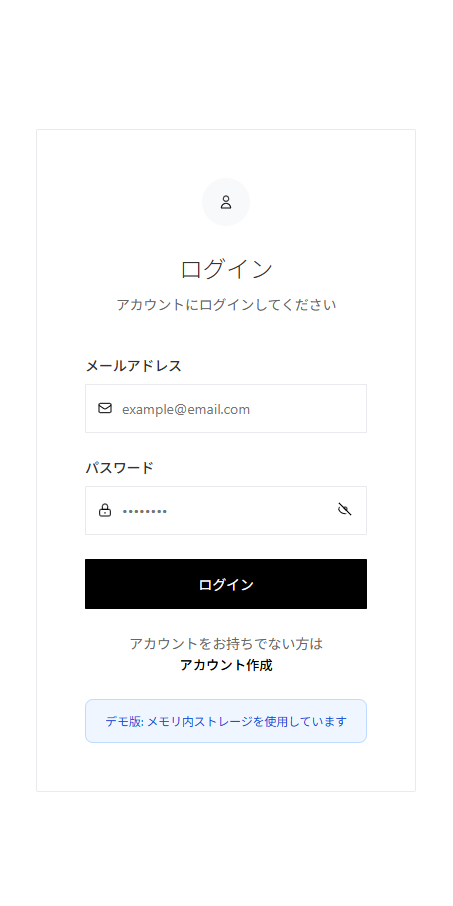
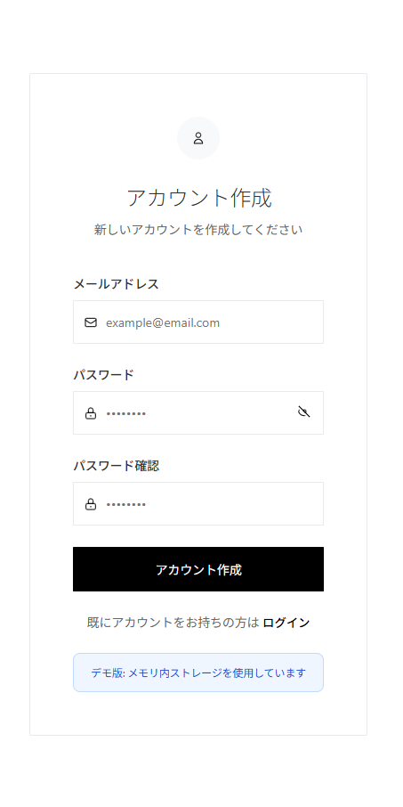

# To-Do App

これは、HTML、CSS、JavaScriptで作成された、シンプルで直感的なTo-Doリストアプリケーションです。

## 主な機能 (工夫した点)

*   **シンプルなデザイン**:
    クリーンで使いやすいインターフェースにより、快適なユーザー体験を提供します。

*   **ログイン機能の実装**:
    ユーザー認証機能を実装し、タスクを安全に管理できます。
    
    

*   **細かな機能の実装**:
    タスクの追加や削除など、To-Do管理に不可欠な機能を備えています。

## 使い方

1.  このリポジトリをクローンします。
2.  `index.html` ファイルをウェブブラウザで開きます。

## 追記

このプロジェクトのコードとドキュメントの一部は、AI（Google Gemini）の支援を受けて作成されました。
